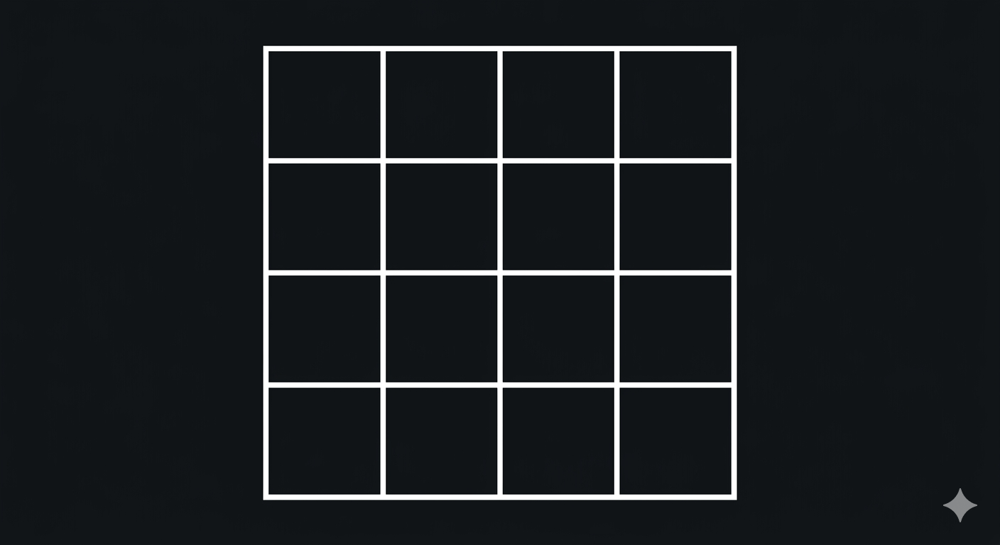

# Hur många fyrkanter? — Gruppövning

**Tid:** 30–35 minuter
**Gruppstorlek:** Hela klassen
**Ingen kod krävs**

---

<!-- BILD: Generera med Gemini och spara som 01_verktyg_och_git/examples/fyrkanter.png

     Prompt:
     "A clean 4x4 grid of equal squares on a dark background.
      White crisp lines, no labels, no shadows, no fill.
      All 16 cells are clearly visible and equal in size.
      Minimalist style, suitable for dark mode display."

     OBS: Vecka 4–5 finns en uppföljare med en svårare bild (hörnrutor, 95+ svar)
     som används som motivation för loopar. Se: _teacher/loopovning_fyrkanter_v2_info.md
-->

> 🤖 *Bilden är genererad med Gemini. Loggan i nedre högra hörnet räknas inte.*
> *Vi använder AI-verktyg i det här kursmaterialet och är transparenta med det när vi gör det.*

---

## Din uppgift

**Räkna alla fyrkanter du kan hitta i bilden.**

*Alla fyrkanter räknas — oavsett storlek.*

---

## Runda 1 — Individuellt (5 min)

Arbeta helt ensam. Skriv ner ditt svar.

- Hur många fyrkanter hittade du? **\_\_\_\_**
- Hur säker är du? (1–10) **\_\_\_\_**

---

## Runda 2 — Par (5 min)

Sätt dig med en person bredvid dig. Jämför era svar.

- Ni behöver komma fram till **ett gemensamt svar**.
- Ert svar: **\_\_\_\_**
- Ändrade någon av er sin ursprungliga åsikt? **Ja / Nej**
- Om ja — varför?

---

## Runda 3 — Grupp om 4 (5 min)

Slå ihop era par. Fyra personer, ett svar.

- Ert svar: **\_\_\_\_**
- Ändrade någon sin åsikt nu? **Ja / Nej**
- Var det någon som ändrade sig *utan att egentligen hålla med*? **Ja / Nej**

---

## Runda 4 — Hela klassen (10–15 min)

Läraren samlar svaren från alla grupper på tavlan.

Vänta på lärarens instruktioner innan ni fortsätter.

---

*Läraren öppnar diskussionen och går igenom svaret.*

