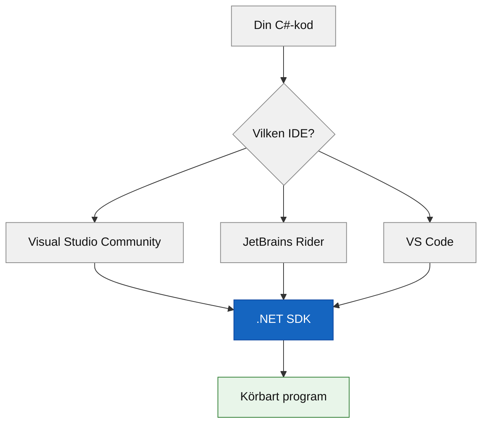

# Programmeringstermer — Verktyg

## Git Bash

Terminalen vi använder genom **hela** kursen — oavsett om din dator kör Windows, Mac eller Linux. Den följer med när du installerar Git, så du behöver inte installera den separat.

```bash
git --version
```

### Output
```plaintext
git version 2.47.0
```

<details><summary>Varför inte cmd.exe eller PowerShell?</summary>

Git Bash fungerar likadant på alla operativsystem. Det betyder att alla guider, alla kommandon och alla klasskamraters skärmdumpar funkar oavsett vilken dator du sitter vid. Vi nämner aldrig cmd.exe eller PowerShell i den här kursen — Git Bash är "terminalen", punkt.

</details>

---

## IDE

Förkortning för **Integrated Development Environment** — programmet du skriver och kör kod i. Det är mer än en textredigerare: en IDE känner till språkets regler, varnar dig innan du kör trasig kod, och kan köra programmet med ett knapptryck.

Tre vanliga val för C#:

| IDE | Pris | Bäst för |
|---|---|---|
| **Visual Studio Community** | Gratis | Nybörjare på Windows — mest guidad upplevelse |
| **JetBrains Rider** | Gratis med studentlicens | Den som vill ha samma IDE oavsett operativsystem |
| **VS Code** | Gratis | Den som redan är bekväm i terminalen och vill ha full kontroll |

Du behöver bara **en**. Alla tre kan köra och felsöka samma C#-kod — valet är en smaksak, inte ett tekniskt krav.



Alla tre vägar leder genom samma SDK till samma resultat — IDE:n är bara gränssnittet du klickar i.

**Se även:** [.NET SDK](#net-sdk) — det IDE:n faktiskt använder för att bygga och köra din kod.

---

## .NET SDK

Det faktiska verktyget som kompilerar och kör din C#-kod. IDE:n är gränssnittet du klickar i — SDK:t är motorn som gör jobbet under huven. Du kan faktiskt köra C#-kod utan någon IDE alls, bara med SDK:t och Git Bash.

```bash
dotnet --version
```

### Output
```plaintext
10.0.100
```

<details><summary>Vad gör `dotnet new`?</summary>

`dotnet new` skapar ett nytt projekt från en mall, utan att du behöver klicka dig igenom en IDE:

```bash
dotnet new console -n MittForstaProjekt
cd MittForstaProjekt
dotnet run
```

Det här är exakt vad en IDE gör i bakgrunden när du väljer "New Project" i menyerna — bara synligt och i terminalen istället för gömt i ett klick.

</details>
